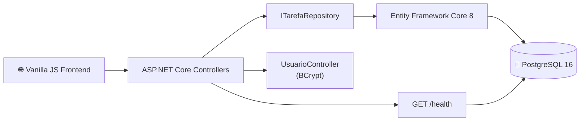

<div align="center">
  
  
  
  
  
</div>

<h1 align="center">📋 Task Manager</h1>
<p align="center">
  <strong>API REST Full-Stack de Gerenciamento de Tarefas com .NET 8, PostgreSQL e Arquitetura Limpa</strong>
</p>
<p>
<strong>Autor:</strong> Gabriel Perencine Lima
</p>
<p align="center">
  <a href="https://taskmanagerneon.vercel.app/">🌐 Acesse o Site</a> &nbsp;|&nbsp;
</p>

---

## 🚀 Visão Geral

O **Task Manager** é uma aplicação full-stack de gerenciamento de tarefas construída para demonstrar boas práticas de Engenharia de Software no desenvolvimento de APIs RESTful modernas. O backend é desenvolvido com **ASP.NET Core 8**, seguindo o **Repository Pattern** para separação de responsabilidades, com acesso a dados via **Entity Framework Core 8** e banco de dados **PostgreSQL 16** hospedado no Neon.tech (serverless). O frontend é uma SPA leve em **Vanilla JS** com dark mode nativo.

O projeto conta com uma pipeline de **CI/CD completa via GitHub Actions**, análise estática de qualidade pelo **SonarCloud** e cobertura de testes reportada ao **Codecov**, garantindo entregas confiáveis e rastreáveis.

---

## ✨ Features Principais

- 📋 **CRUD Completo de Tarefas:** Criação, listagem paginada, edição e exclusão de tarefas por usuário.
- 👤 **Gestão de Usuários:** Cadastro e autenticação com senhas criptografadas via **BCrypt**.
- 🔒 **Segurança por Design:** Zero credenciais no código — todos os segredos carregados via variáveis de ambiente.
- 🏥 **Health Check:** Endpoint `/health` com monitoramento em tempo real da API e do banco de dados.
- 📄 **Documentação Automática:** Swagger/OpenAPI gerado automaticamente com anotações enriquecidas.
- 📊 **Logs Estruturados:** Logging em JSON com **Serilog** para fácil integração com ferramentas de observabilidade.
- 🐳 **Testes de Integração com Docker:** Banco de dados PostgreSQL real provisionado via **Testcontainers** nos testes.
- 🌙 **Frontend com Dark Mode:** Interface web responsiva construída em HTML, CSS e JavaScript puro.

---

## 🛠️ Tecnologias

A aplicação foi construída com tecnologias consolidadas do ecossistema .NET:

- **Backend:** ASP.NET Core 8, Entity Framework Core 8, Npgsql, BCrypt.Net 4.2.0, Serilog 10.0.0, Swashbuckle 6.6.2, AspNetCore.HealthChecks.
- **Banco de Dados:** PostgreSQL 16 via [Neon.tech](https://neon.tech) (Serverless).
- **Frontend:** JavaScript ES6+, HTML5, CSS3 com Dark Mode nativo.
- **Testes:** xUnit, Moq 4.20, FluentAssertions 8.10, Testcontainers.PostgreSql 4.11, Coverlet.
- **Qualidade & CI/CD:** SonarAnalyzer.CSharp 10.25, SonarCloud, GitHub Actions, Codecov, Docker, Railway, Vercel.

---

## 🏛️ Arquitetura e Engenharia

O projeto adota o **Repository Pattern** combinado com **Arquitetura em Camadas**, garantindo separação de preocupações, testabilidade e baixo acoplamento:

- **Controllers:** Responsáveis apenas por receber requisições HTTP, validar entrada e devolver respostas — sem lógica de negócio embutida.
- **Repository (`ITarefaRepository`):** Abstração do acesso a dados, permitindo que os controllers sejam testados com mocks sem dependência de banco.
- **EF Core + Npgsql:** ORM que mapeia entidades C# para o PostgreSQL, com migrações versionadas.
- **Segurança:** A connection string nunca é commitada — carregada via `ConnectionStrings__DefaultConnection` como variável de ambiente na plataforma de hospedagem.

### Diagrama de Arquitetura



---

## 📡 Endpoints da API

| Método | Rota | Descrição |
| :--- | :--- | :--- |
| `POST` | `/api/usuario/register` | Cadastro de novo usuário |
| `POST` | `/api/usuario/login` | Autenticação, retorna ID do usuário |
| `GET` | `/api/tarefas/usuario/{id}` | Lista tarefas paginadas (`?page=1&pageSize=20`) |
| `GET` | `/api/tarefas/{id}` | Retorna detalhes de uma tarefa |
| `POST` | `/api/tarefas` | Cria uma nova tarefa |
| `PUT` | `/api/tarefas/{id}` | Atualiza uma tarefa existente |
| `DELETE` | `/api/tarefas/{id}` | Remove uma tarefa |
| `GET` | `/health` | Status da API e do banco de dados |

---

## ⚙️ Como Rodar Localmente

### 1. Pré-requisitos

- [.NET 8 SDK](https://dotnet.microsoft.com/download/dotnet/8.0) instalado.
- [Docker Desktop](https://www.docker.com/products/docker-desktop/) instalado (para os testes de integração com Testcontainers).
- Uma instância de **PostgreSQL** local ou uma conta no [Neon.tech](https://neon.tech) (gratuito).

### 2. Clonando o Repositório

```bash
git clone https://github.com/GPerencine/task-manager-fullstack.git
cd task-manager-fullstack
```

### 3. Variáveis de Ambiente

Crie o arquivo `TaskManagerAPI/appsettings.Development.json` (já está no `.gitignore`):

```json
{
  "ConnectionStrings": {
    "DefaultConnection": "Host=localhost;Database=taskmanager;Username=postgres;Password=suasenha"
  }
}
```

### 4. Aplicando as Migrações e Executando

```bash
# Aplica as migrações no banco de dados
cd TaskManagerAPI
dotnet ef database update

# Inicia a API
dotnet run
```

Acesse [http://localhost:5000/swagger](http://localhost:5000/swagger) para explorar a documentação interativa da API.

### 5. Executando os Testes Automatizados

O projeto conta com testes unitários (sem banco) e testes de integração com banco PostgreSQL real via Docker:

```bash
# Executa toda a suíte de testes (requer Docker em execução para os de integração)
dotnet test TaskManagerAPI/TaskManagerAPI.sln --verbosity normal
```

---

## ⚙️ CI/CD Pipeline

A cada `push` na branch `main`, o pipeline executa automaticamente as seguintes etapas:

```
Checkout → Setup .NET → Restore → Begin SonarQube → Build → Tests + Coverage → End SonarQube → Codecov
```

**Secrets necessários no repositório:**

| Secret | Descrição |
| :--- | :--- |
| `SONAR_TOKEN` | Token de acesso ao SonarCloud |
| `CODECOV_TOKEN` | Token de upload de cobertura ao Codecov |

---

## 📄 Licença

Este projeto está licenciado sob a [MIT License](LICENSE).

---

<p align="center">
  Desenvolvido com rigor técnico para demonstrar boas práticas de Engenharia de Software com .NET. 🚀
</p>