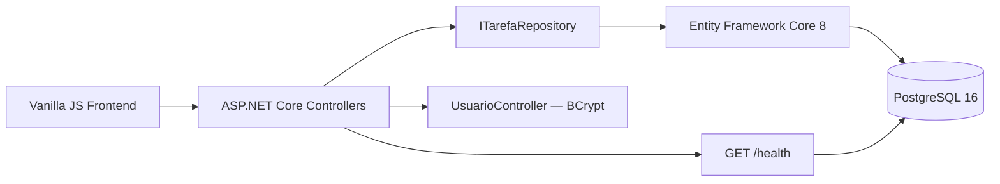

<div align="center">

# 📋 Task Manager

<p>
  
  
  
  
  
  
</p>

**API REST de gerenciamento de tarefas construída com ASP.NET Core 8, PostgreSQL e arquitetura em camadas.**

[🌐 Acesse o Site](https://taskmanagerneon.vercel.app)
</div>

---
<div align="center">
  Desenvolvido por <strong>Gabriel Perencine Lima</strong>
</div>

## Sobre

Task Manager é uma aplicação full-stack que demonstra boas práticas de engenharia de software no desenvolvimento de APIs RESTful com o ecossistema .NET. O backend segue o **Repository Pattern** com Entity Framework Core, testes de integração usando banco de dados PostgreSQL real via **Testcontainers**, e pipeline de qualidade com SonarCloud e Codecov. O frontend é uma SPA leve em Vanilla JS com dark mode nativo.

---

## Funcionalidades

| Feature | Descrição |
|---|---|
| 📋 CRUD de Tarefas | Criação, listagem paginada, edição e remoção por usuário |
| 👤 Gestão de Usuários | Cadastro e autenticação com BCrypt |
| 📊 Logs Estruturados | Logging em JSON via Serilog |
| 🐳 Testes de Integração | PostgreSQL real provisionado via Testcontainers |

---

## Stack

| Camada | Tecnologia |
|---|---|
| **Backend** | ASP.NET Core 8, Entity Framework Core 8, Npgsql |
| **Banco de Dados** | PostgreSQL 16 — [Neon.tech](https://neon.tech) (serverless) |
| **Segurança** | BCrypt.Net 4.2, variáveis de ambiente (zero secrets no código) |
| **Observabilidade** | Serilog, AspNetCore.HealthChecks, Swagger |
| **Frontend** | Vanilla JS ES6+, HTML5, CSS3 com dark mode |
| **Testes** | xUnit, Moq, FluentAssertions, Testcontainers.PostgreSql, Coverlet |
| **Qualidade / Deploy** | SonarCloud, Codecov, GitHub Actions, Docker, Railway |

---

## Arquitetura

O projeto segue o **Repository Pattern** com separação estrita de responsabilidades:



---

## Endpoints da API

| Método | Rota | Descrição |
|---|---|---|
| `POST` | `/api/usuario/register` | Cadastro de novo usuário |
| `POST` | `/api/usuario/login` | Autenticação — retorna ID |
| `GET` | `/api/tarefas/usuario/{id}` | Lista tarefas paginadas (`?page=1&pageSize=20`) |
| `GET` | `/api/tarefas/{id}` | Detalhes de uma tarefa |
| `POST` | `/api/tarefas` | Cria tarefa |
| `PUT` | `/api/tarefas/{id}` | Atualiza tarefa |
| `DELETE` | `/api/tarefas/{id}` | Remove tarefa |
| `GET` | `/health` | Status da API e do banco |

---

## Configuração Local

**Pré-requisitos:** [.NET 8 SDK](https://dotnet.microsoft.com/download/dotnet/8.0), [Docker Desktop](https://www.docker.com/products/docker-desktop/) (para os testes de integração), instância PostgreSQL local ou conta no [Neon.tech](https://neon.tech).

```bash
git clone https://github.com/GPerencine/task-manager-fullstack.git
cd task-manager-fullstack
```

Crie `TaskManagerAPI/appsettings.Development.json`:

```json
{
  "ConnectionStrings": {
    "DefaultConnection": "Host=localhost;Database=taskmanager;Username=postgres;Password=suasenha"
  }
}
```

```bash
cd TaskManagerAPI
dotnet ef database update   # Aplica as migrações
dotnet run                  # http://localhost:5000/swagger
```

```bash
# Testes (requer Docker para os de integração)
dotnet test TaskManagerAPI/TaskManagerAPI.sln --verbosity normal
```

---

## CI/CD Pipeline

```
Checkout → Setup .NET → Restore → Begin SonarQube → Build → Tests + Coverage → End SonarQube
```

